# Modelling-Movies (Predicting imdb rating of movies)

The main aim of my project is to predict the `IMDB` rating of movies (present in my dataset). 
I have broken down this project into 2 parts. First being the EDA (Exploratory Data Analsyis), and second being model developement. 

Before moving onto EDA, I want to point out some facts about my dataset. The dataset consists of 651 observations and 32 columns/variables. Now let us start with the 1st part of my project. To ease my analysis, I have broken down the entire dataset into 2 subsets: `subset_data_1` and `subset_data_2`. I will explain what variables are present in each 'subset' latre on.

## EDA (EXPLORATORY DATA ANALYSIS)

`EDA` or `Exploratory Data Analysis` is usually performed to take a peek into the data. For me, it was to select the varibales on which my model will be based on. I wanted to check whether there existed any relationship between variables (independent and dependent) before creating the model. Now an important question for me was to select the questions to perform EDA. Selecting questions for any EDA is highly biased towards the fact the dataset someone is working on. As I was working on a movie's dataset , my questions were focused on the variables that actually had an impact on determining the popularity of a movie.

There were two main factors which actually helped me in sorting this problem. These factors where published in the study 'DEBATES AND ASSUMPTIONS ABOUT MOTION PICTURE PERFORMANCE: A META ANALYSIS' present in the 'JOURNAL OF THE ACADEMY OF MARKETING SCIENCE'.

1. When a movie is released, it is the 'STAR POWER' of a popular actress/actor, that has the highest influence on the box office. However, if the movie has been on screen for a very long period, then the pull of a 'STAR' usually fades away and it is the acting capabilities of the 'STAR' that takes over the influence. In other words, choosing a film is highly biased towards the fact, that an actor/actress and in even in some cases the director of the movie has/had received any form of awards and recognitions in the past.
2. Researchers found out that the critics had a dual role to play, they had to influence the consumer's movie choice and also predict box-office performance, based on the taste of moviegoers. In this case it was not only the positive and negative reviews but also the number of reviews in each case that could predict a box office hit. So, the lesson was to review the movies from as many critics as possible. In other words, the critics score and audience score play a very important role for many people in determining the whether they would like to watch a movie or not. 

So, combining the 2 points together, if we want to increase our chances of picking a great movie, we have to make sure that it has a popular actor/actress, directed by an Oscar/Golden globe award winning Director, check out the critic’s reviews, have a look at the audience ratings, and also even in some cases check out the genre of the movie. Keeping in mind the above points I have decided the ANALYSIS QUESTIONS.

1. What is the relationship between imdb_rating, critics_score and audience_score?
2. Is a movie’s imdb_rating, associated with certain key attributes of the movie, namely: 'best actor win', 'best actress win', 'best director win', ‘best picture win’ and ‘genre’.

Before moving on towards further questions, I would like to show you what variables of my 'original dataset' are present in each 'subset' that I had created earlier.

For `subset_data_1` we have the following variables:

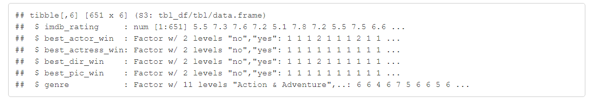

For `subset_data_2` the variables are:

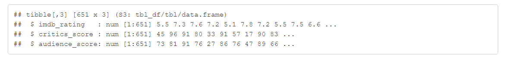

An important question that occurred to me was `How should I select the 'Dependent Variable' for my model and What variable should it be`. The model that I will be creating is going to predict movie’s popularity based on 3 response variables, and I will select one of them to act as the dependent variable for my model.
The target response variable for my prediction is a ‘MOVIE RATING SCORE’. Now I have 3 options to choose from – imdb_rating, critics_score and audience_score. I selected only one of them for my model. Before selecting a dependent variable (for any model), we have to check for the histogram distribution of that variable, to determine whether the histogram is NORMALLY DISTRIBUTED or NOT. If we have no NORMAL DISTRIBUTION then it would increase the VARIABILITY, which in turn would affect/increase the STANDARD ERROR, thus making it difficult for me to GENERALIZE my CONCLUSIONS to the POPULATION at large.

So, the real question that I had to ask myself was, which one to choose from? Since all three of them are metrics to determine 'MOVIE RATING' we would expect to see a correlation between the different rating scores.  Before proceeding to plot for the correlation, what I have done is draw a scatterplot between the three variables to check for linearity. 

The `plot and correlation values`:

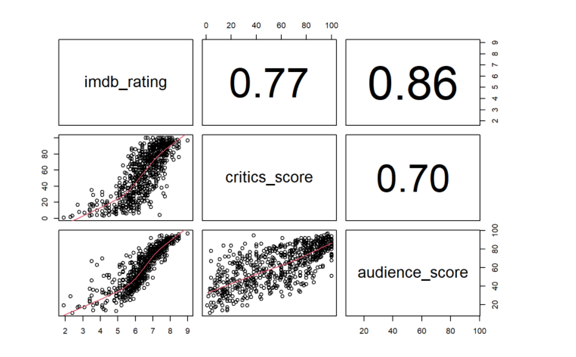

We have a strong positive correlation between all the 3 variables. However, imdb_rating and audience_score chalked up a greater value of positive correlation coeffecient. Thus, I will be choosing one of them as my `Dependent Variable`. Now to decide which variable to select I will draw a histogram, and check which plot has a more NORMAL DISTRIBUTION (No normal distribution, more variance, more standard error, more is the p-value, greater the p-value, less is the relation between two or more variables).

The plot of `histograms` is as follows:

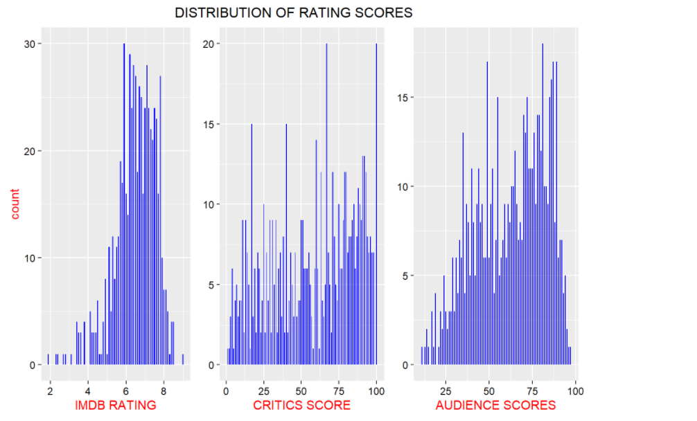

#### 1st ANALYSIS CONCLUSION
-> This concluded my 1st EDA analysis. The conclusion of my 1st EDA thus gave me the `Dependent Varible` to worh with.

For 2nd analysis, my main goal at the end was to get a logical sense of distribution between my dependent and 'possible' independent variables. I said ‘possible’ because it might happen that when I create my model, there would be additional variables that I have to take into account OR it could have happened that the variables on which I performed my original EDA, were not at all included in my model. I had drawn `boxplots`, to understand the relationship between imdb_rating and best_actor/actress/pic/dir_win. 

#### 2nd ANALYSIS CONCLUSION
I have broken down my deductions in 2 parts:

1. During my analysis of imdb_rating with best_pic_win, I found out the movies that had won a Best Picture Oscar had a higher imdb_ rating as compared to its other half. Also, the summary statistics revealed that the max imdb_rating for pictures that had not won an Oscar was 8.0 (minimum being 1.9), and the minimum imdb_rating of pictures which had one at least one Oscar was 7.9 (the maximum being 9.0). Thus, no symmetry existed in 2 cases, and I could conclude that best_picture_win could be an important predictor for my model.

`boxplot` of imdb_rating vs best_pic_win:

`Summary Statistics` of the same:

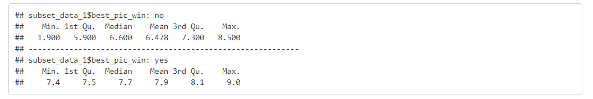

2. The same however could not be said for actor, actresses and director win. In case of boxplot, of imdb_rating and actors I found out that movies that had actors without any win (maybe from Oscar or Golden Globe/Emmy) and actors who had won a prize had nearly same distribution of max, min and median values thus showing symmetry. So, there was high probability that these variables would not be present in my model.

Finally, I ended my analysis with a histogram of the `Dependent Variables`. From the histogram, I found out that the `imdb_rating` was concentrated in the 6-8 range, and was skewed to the left.

`Histogram` of imdb_rating:

## MODELLING

Before proceeding to predict the **IMDB** rating of movies, I had to decide which variables to appoint as `Independent/Explanatory Variables` for the model. I could not include all 32 variables, because most of them were irrelevant and I had already concluded through **EDA**, the probable variables that could have had an impact on the `Dependent Variable`. The real question was, **Were there anymore principal variables?**. Actually, there were 2 possible variables that someone might include to get a better model (Well, to be honest I would never know unless I create the model, but was a good hunch). They were, `title_type` and `mpaa_rating`. 

Finally all my variables (`Dependent` and `Independent`) were:

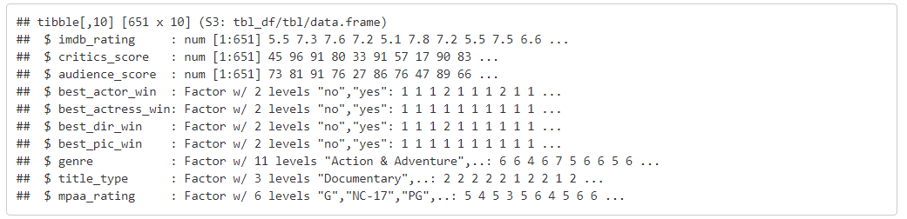

Now, the first step in my model creation was split the entire dataset into subparts. I followed an 80-20 split. 80% of my data represented training data and 20% testing data. I could have considered a 75-25 split, but the key point to understand was that, more samples lowered the variance, which in turn let down the Standard Error and thus lower was the significance value (p-value), giving us a better model.

The next step, was to create the model. I employed **Multiple Linear Regression** for model creation. More specifically I used **Stepwise Regression (both Forawrd and Backward)** to eliminate avoidable variables. I had a look at the `AIC` values, followed by `R-squared` values (of the entire model) and then `p-value` (of each variable in the model).  Ultimately, after I had a parsimonious model I finished my model diagnostics through visualization tools: histogram, normality of residuals and scatterplot to check for **Normality of Residuals** and **Homoscedasticity or constant spread of residuals**.

The final model displayed the following `AIC` value:

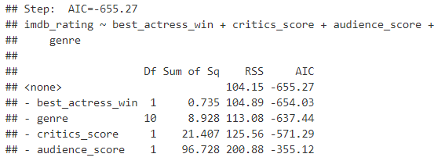

Lower the `AIC` value, better is our model (as it indicates a better fit). 

`R-squared` value and `p-values`:

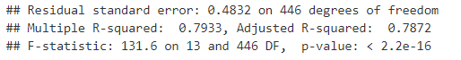

Higher `R-squared` value is usually preferred, but it goes on increasing as we add more variables to our model. Thus, we should have a look at the `Adjusted R-squared` value which usually peaks at a certain point and remains constant. Our model had a value of `0.7872`, which was good. Lower `p-value` is always the best choise. I had set a significance level of 5%, and the `p-value` of our model was very much within that limit.

#### MODEL DIAGNOSTIC

After I had a final parsimonious model, my next step was model diagnostics, where I examined with the help of visualization tools (like histogram, normal probability plot and a scatterplot), whether certain critical conditions proved to be true in order for the method of ‘Ordinary Least Squares’ to be valid.

-> Normality Of Residuals: This condition tells us whether the residuals are normally distributed centred at 0 or not. To check for normality of residuals,I had plotted for **Normal Probability Plot** and **Histogram** (both the graphs are of residuals).

*Histogram*:
 
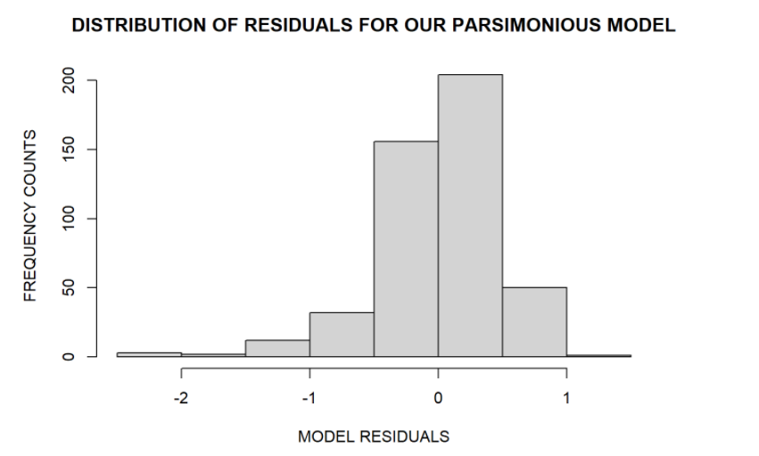

*Normal Probability Plot*:

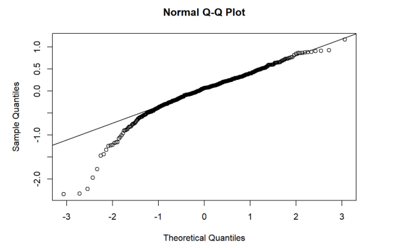

Result - **Histogram** is little skewed to the left (thus showing that we might have possible vectorial outliers). The **Normal Pobability Plot** also reflects the same result.

-> Homoscedasticity: Homoscedasticity, refers to the fact that the residuals have constant spread over different values of explanatory variables. It implies that the variance of residuals across the regression line remains same, irrespective of the explanatory variables present.

*Homoscedasticity Plot*:

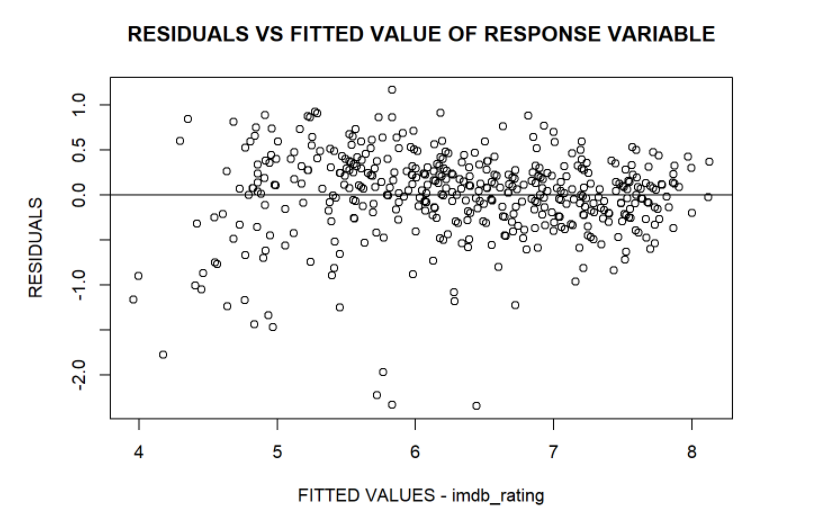

